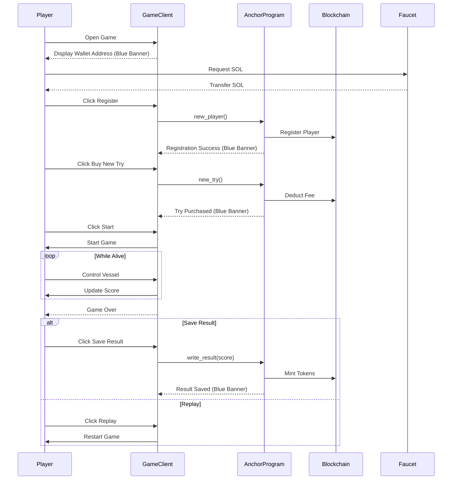

# Orbit 🚀

A hyper-casual, fast-paced game designed to help you pass the time quickly, have fun, and even earn some rewards! Collect rings, open chests, discover new vessels, and upgrade them to fly as high as you can.

Earn **$Orbitals**, get NFTs of vessels, trade them with other players, and don't forget to beat records to get weekly rewards!

---

❗️ **Important message**: Due to the high prices and the fact that it will take a long time to collect tokens, 25k points will be added at the end of each attempt to make the game easier to review. This is solely for the review of Gaming Sonic Rush judges to facilitate testing of chest openings and buying upgrades. ❗️

---

## 🌌 Cover Images

  
*Figure 1: Navigate through the stars.*

---

## 🌟 Features

- **Blockchain Integration**: experience seamless blockchain integration using the Sonic SVM layer. Your progress, assets, and achievements are securely stored on the blockchain, providing transparency and true ownership of in-game items.

- **Sonic Interactions Highlighted**: all interactions with the Sonic blockchain in the game are marked with a blue banner. This ensures you won't miss any important blockchain-related actions.

- **Compete**: show off your skills and climb to the top! Share your stellar results with friends and see who truly rules the ORBIT.

- **Unlock**: open chests to collect an array of unique vessels, each minted as an NFT. Each new vessel brings you closer to becoming the ultimate space explorer.

- **Choose**: each vessel comes with its own special ability. Find the one that best suits your strategy and dominate space.

- **Strategize**: customize your vessel with four types of upgrades. You have 10 points available for each upgrade type but only 24 points to spend in total. Craft your own unique tactics by deciding which upgrades to prioritize!

- **Second Chances**: not thrilled with your performance? No worries! You can choose to save your attempt or replay the level to aim for a better result.

- **Overcome**: test your piloting skills against four types of space hazards: asteroids, comets, meteorite belts, and satellites. Each obstacle offers a new challenge to conquer.

- **Token Economy**: the fees collected for registration and gameplay attempts will be contributed to the token's liquidity pool, ensuring a healthy and sustainable in-game economy. This approach allows the **$Orbitals** token to maintain value and provides players with meaningful rewards.

- **🎨 Minimalist Graphics**: orbit features a sleek, minimalist art style predominantly in black and white. This choice was intentional, not out of laziness or ease of asset creation, but to emphasize the **ease of using the Sonic blockchain** and **streamlined game development**. The minimalist design not only enhances visual appeal but also ensures smooth performance across devices, creating a stylish and engaging user experience.

---
## 🛠️ Getting Started

To get started with **Orbit**, you have two options:

### 📱 Install via APK on Android

1. **Download the APK**:
   - *[This file from repository](#)*

2. **Install the APK**:
   - Transfer the APK file to your Android device.
   - Open the APK file on your device and follow the on-screen instructions to install the game.

### 🖥️ Play via Godot Engine

1. **Download Godot 4.3**:
   - Visit the [Godot Engine Download Page](https://godotengine.org/download/windows/) and download Godot 4.3 for Windows.

2. **Download the Game Project**:
   - *[This folder from repository](#)*

3. **Import the Project into Godot**:
   - Open Godot Engine.
   - Click on **Import** and navigate to the downloaded folder.
   - Select the project file and click **Import & Edit**.

4. **Run the Game**:
   - Once the project is loaded, click the **Play** button to start the game.

---

## 🕹️ How to Play

1. **Get SOL Tokens (First Time Only)**:
   - **Copy Wallet Address**: Click on your wallet in the game to copy your wallet address.
   - **Get SOL from Faucet**: Visit the [Sonic Faucet](https://faucet.sonic.game/#/) and drop SOL into your wallet.

2. **Register**:
   - Click the **Register** button to create your account and begin your journey.

3. **Purchase a Gameplay Attempt**:
   - If you have no attempts left, click **Buy New Try** to purchase an attempt using SOL.

4. **Start the Game**:
   - Click **Start** to begin your ascent.

5. **Control Your Vessel**:
   - Use the bottom joystick to fly upwards and navigate your vessel.
   - Avoid obstacles like asteroids, comets, meteorite belts, and satellites.

6. **Collect Items**:
   - **Coins**: Each coin collected adds **+10 points** to your score.
   - **Stars**: Grants a booster with invulnerability for a short duration.

7. **Game Over**:
   - When you lose, you have two options:
     - **Replay**: Try again without consuming an attempt.
     - **Save Result**: Click **Save Result** to consume one attempt, save your score, record it on the leaderboard, and mint tokens to your wallet.

*(All interactions with the Sonic blockchain are marked with a blue banner in the game, ensuring you won't miss any important blockchain-related actions.)*

---
## 🎥 Demo | Trailer

[Watch the game trailer here!](https://www.youtube.com/shorts/ZTcbbzKCB-g) - *i did it for fun, better watch the gameplay!*

[Watch the gameplay here!](https://www.youtube.com/watch?v=keA1qONlrCE)

---

## 🎮 About My Game

Where did I get the idea for this game? I took a deep dive into the world of the crypto community and noticed the most important phrase of all crypto enthusiasts: **"To the moon!"** Every self-respecting person, when buying something (be it a meme coin, NFT, altcoin, BTC, etc.), always thinks "to the moon" as they update the chart every 5 minutes. This is the core, the base, the foundation.

That's why I present to you a game where the main goal is to fly upwards, *just like a Sonic token after the release of the mainnet*. However, every asset can't just fly upwards, it faces obstacles like FUD (Fear, Uncertainty, and Doubt), panic, bad news in the real world. I brought this into the game in the form of space objects that try to knock down the player, and you need to dodge and fly around them.

but..

I didn't want to make a simple game and just give up on it after the Game Jam.

First, I decided to research the market and saw a very interesting [article](https://android-developers.googleblog.com/2023/07/new-blockchain-based-content-opportunities-google-play.html) about Google allowing blockchain integration in Google Play games. This is my chance! To become the first developer of a Sonic SVM game on Google Play! This was my main motivation during development, it was the reason to do something cool, something working, and exciting. This will be my motivation to complete the project to the end.

I also won't hide the fact that I got my first pang of curiosity when I accidentally noticed this Gaming Sonic Rush with huge $$$ rewards. In fact, I have been dreaming of creating my own game all my life, maybe it's just a childhood dream, because I never finished the job and constantly gave up halfway due to certain life circumstances. However, this event, in my opinion, is my destiny. And Sonic SVM is my opportunity.

---

## 📘 Project Overview | Information for Sonic Gaming Rush

**Orbit** is a hyper-casual game developed for the [Sonic Gaming Rush SVM GameJam](https://earn.superteam.fun/listings/hackathon/sonic-radar/). It integrates blockchain technology using the Sonic SVM platform to enhance gameplay with NFTs and token rewards.

### 🔗 Functionality and Sonic SVM Integration

- **Blockchain-Powered Leaderboard**: recognizing the inherently competitive nature of players, the leaderboard system is crucial for maintaining engagement and encouraging continuous play. It is fully integrated with the blockchain, ensuring transparency and immutability of scores. Social sharing capabilities allow users to showcase their rankings and results to friends or post them on Twitter, enhancing the communal experience. The leaderboard is implemented as a robust user database, with backend code written in Rust and deployed on the Sonic SVM using Anchor.

- **NFT-Based Chest Opening**: the "Chest Opening" feature introduces an exciting element of chance and collection into the gameplay. This mechanic is a seamless integration of minting NFTs into the game experience. After accumulating a certain number of on-chain tokens, players can "open a chest" to receive a random NFT of a vessel, each with unique attribute. This not only adds variety to the fleet but also offers strategic advantages. Players have the flexibility to sell these NFTs on any NFT marketplace or use them within the game to enhance their capabilities.

- **Token Economy**: to embark on the interstellar adventure, a one-time registration fee of **0.1 SOL** is required (for testing purposes, players can use the [faucet](https://faucet.sonic.game/#/)). Each gameplay attempt can be purchased for **0.05 SOL**. *[not yet implemented] The fees collected are directed into the **$Orbitals** token's liquidity pool, ensuring a healthy and sustainable in-game economy. This approach allows the token to maintain value and provides players with meaningful rewards.*

- **Dynamic Upgrade System**: players can customize their vessels with a dynamic upgrade system. They can acquire up to **24 upgrades** using tokens and distribute them among various vessel characteristics, with a maximum of **10 upgrades per attribute**. This allows for deep strategic planning, enabling users to tailor their ship's performance to their preferred playstyle.

---

## 🔑 Public Keys

- **Leaderboard**: `HmdJX8fzufqSf9JvmAyrS8jebyh7mKCeXzX5rhdfYZN6`
- **Program**: `orbpLfjHANgBMthuUp3ZsGewMwpE6HN6JXk9dypZ11U`
- **Owner**: `orbwa31L7BZ2bTTg9QgUPTxAB7KnFfeU8oT9b56XG7f`
- **NFT Collection**: `orbnuDBpRzHJzjd4Ki9Kqz8LNijqmDYNWVeavYkJVjz`
- **NFT Guard**: `6kLTGfccW6d1HgeWvGsetfB1U3QxeVMmXTEGVexopwZu`
- **Token**: `ED5BmhZd5KPFTzDSv6r7Z6xB3CS5DGXEqKhVDntuPQwh`
- **Test user account with in-game assets**: `Eb9hJKJg9BL6B1LGxCL7HQ25H5VVxDcymVWdnf6t5amQ`

---

## ⚙️ Anchor Program Information

The game's backend is implemented using an **Anchor** program in Rust, deployed on the Sonic SVM platform. The program handles token minting, leaderboard management, player registration, gameplay attempts, and NFT minting.

### 📊 UML Diagram of Program


*(The diagram above represents the flow of actions during a gameplay session, including interactions with the blockchain via the Anchor program.)*

### **Code Overview:**

```rust
use anchor_lang::{prelude::*, system_program};
use solana_program::pubkey;
use anchor_spl::{
    associated_token::AssociatedToken,
    token::{self, mint_to, Mint, MintTo, Token, TokenAccount},
    metadata::{create_metadata_accounts_v3, mpl_token_metadata::types::DataV2, CreateMetadataAccountsV3, Metadata as Metaplex}
};

declare_id!("orbpLfjHANgBMthuUp3ZsGewMwpE6HN6JXk9dypZ11U");
const GAME_OWNER_PUBKEY: Pubkey = pubkey!("orbwa31L7BZ2bTTg9QgUPTxAB7KnFfeU8oT9b56XG7f");

#[program]
pub mod orbit_leaderboard {
    use super::*;

    pub fn new_player(ctx: Context<NewPlayer>, username: String) -> Result<()> {
        // Player registration logic
    }

    pub fn new_try(ctx: Context<NewTry>) -> Result<()> {
        // Purchase new gameplay attempt
    }

    pub fn write_result(ctx: Context<WriteResult>, score: u64) -> Result<()> {
        // Save result and mint tokens
    }

    // Additional functions...
}

// Structs and account definitions
```

_For the complete source code, please refer to the [file](https://github.com/mat-shur/sonic-orbit/blob/main/anchor_program/src/lib.rs)._

---

## 🛠️ Known Issues

- [ ] **Insufficient Protection of Anchor Program**: the Anchor program currently lacks adequate safeguards against unauthorized access by external users. 

- [ ] **Limited Data Validation in Game**: there are minimal checks to ensure the integrity of data within the game.

- [ ] **Unimplemented Liquidity Pool for Token**: the liquidity pool for the **$Orbitals** token has not been fully realized.

- [ ] **Minimal Time Spent on Testing**: due to time constraints, extensive testing has not been conducted. 

- [ ] **Unoptimized APK Size**: the current APK size is larger than optimal.

- [ ] **Increase Content Quantity**: additional content such as new levels, vessels, and challenges needs to be developed to enhance player engagement and retention.

- [ ] **App Crash when Sonic SVM Crashes**: when Sonic SVM crashes, it can cause the app to crash. This issue is currently in fixing process. 
So, if the game crashes, it's likely that Sonic SVM is inaccessible at that time.


---

## 🙏 Acknowledgements

- [Sonic SVM](https://docs.sonic.game) for providing the SVM layer.
- [Anchor Framework](https://www.anchor-lang.com/) for the robust development framework.
- [Godot Engine](https://godotengine.org/) for the game development platform.

---

## 👨‍💻 About Me

Hi! I'm [Matvii Shur](https://www.github.com/mat-shur), the developer behind **Orbit**. Creating games has been a lifelong dream of mine. This project is the culmination of my passion for gaming and blockchain technology. I believe that integrating blockchain into casual games can bring new and exciting experiences to players.

---

## 📫 Contact

- **Email**: [matshur220@gmail.com](mailto:matshur220@gmail.com)
- **Twitter**: [@Bredemar12](https://x.com/Bredemar12)
- **Discord**: @matvij5967
- **Telegram**: [@elizsfic](https://t.me/elizsfic)

---

Thank you for taking the time to explore **Orbit**. I hope you enjoy playing it as much as I enjoyed creating it! 🚀🌕

Feel free to reach out if you have any questions or feedback. Happy gaming!
